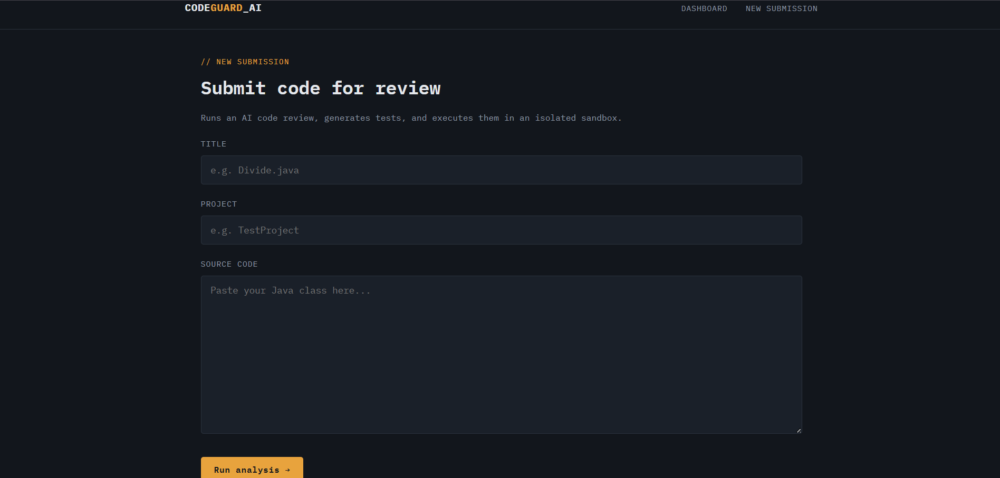
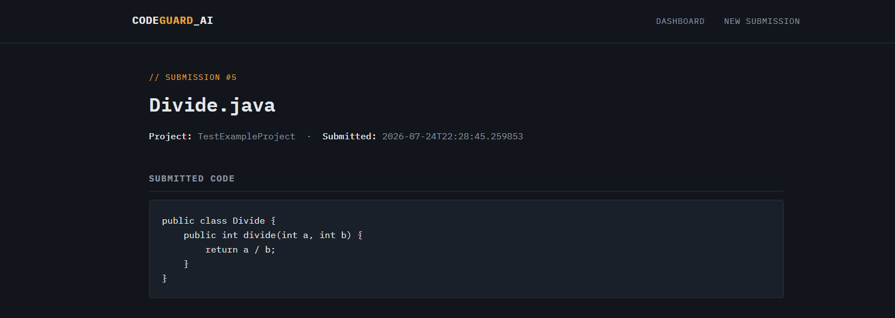
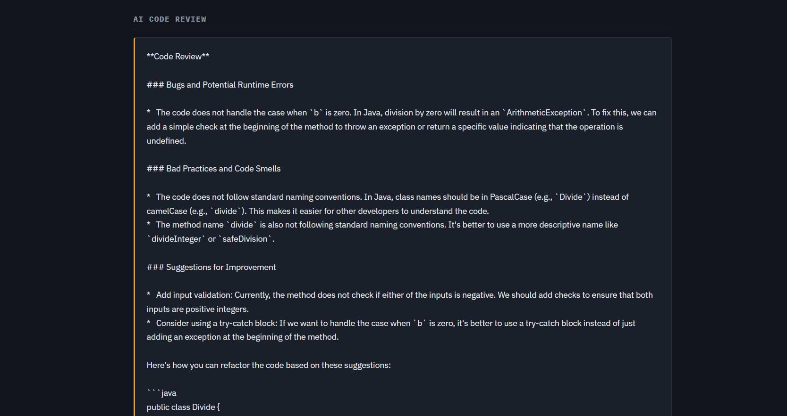
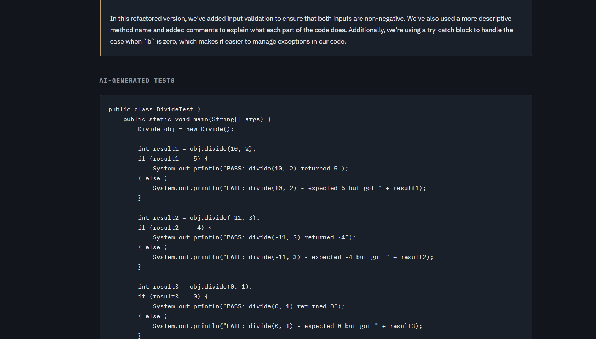

# CodeGuard AI

**AI-powered code review and automated test execution platform**, built with Java, Spring Boot, Spring AI, and JSP.

Submit a Java class, and CodeGuard AI will:
1. Generate an **AI code review** — bugs, code smells, and improvement suggestions
2. Generate **self-contained unit tests** via AI
3. **Compile and execute** those tests in an isolated, resource-limited sandbox process
4. Persist and display everything on a dashboard

The goal isn't just to have an AI *comment* on code — it's to actually **run** the AI's own generated tests and verify its claims against real Java runtime behavior.

---

## Why this project exists

Most "AI code review" tools stop at step 1 — the AI reads your code and gives an opinion. But an LLM's opinion about what code *should* do isn't the same as verifying what it *actually* does. CodeGuard AI closes that gap by having the AI write tests, then genuinely compiling and running them in a sandboxed process, rather than trusting the model's output blindly.

**A real example this caught during development:** given a method computing `-11 / 3`, the AI generated a test expecting `-4` (based on general "floor division" math reasoning). The sandbox actually ran the code and returned `-3` — because Java's integer division truncates toward zero, not toward negative infinity. The AI review alone wouldn't have caught this; only real execution did.

---

## Screenshots

| Dashboard | Submit Form |
|---|---|
|  |  |

| AI Review + Verdict |
|---|
|  |

|AI Tests|
| |

---

## Architecture

```
Browser (JSP)
   │  POST /submit
   ▼
DashboardController (Spring MVC)
   │
   ├─ 1. Save CodeSubmission ──────────────► MySQL
   │
   ├─ 2. CodeReviewService ──► Ollama (local LLM) ──► save ReviewResult
   │
   ├─ 3. TestGeneratorService ──► Ollama ──► save GeneratedTest
   │
   └─ 4. SandboxExecutionService
          a. write test code to a temp .java file
          b. compile with javax.tools.JavaCompiler
          c. run in an isolated JVM process (ProcessBuilder)
             - heap capped (-Xmx128m), stack capped (-Xss4m)
             - hard timeout, forcibly killed if exceeded
          d. capture stdout, parse PASS/FAIL/PARTIAL
          e. always clean up temp files
          │
          └─► save TestExecutionResult ──► MySQL
   │
   ▼
redirect to /review/{id} — renders everything from the DB
```

### Data model

| Entity | Relationship |
|---|---|
| `CodeSubmission` | root entity — the submitted class |
| `ReviewResult` | many-to-one → `CodeSubmission` |
| `GeneratedTest` | many-to-one → `CodeSubmission` |
| `TestExecutionResult` | many-to-one → `GeneratedTest` |

---

## Tech Stack

- **Language:** Java 17
- **Backend:** Spring Boot 3.5, Spring MVC, Spring Data JPA (Hibernate)
- **AI:** Spring AI + Ollama (local LLM inference — default model: `llama3.2`)
- **Database:** MySQL
- **Frontend:** JSP, JSTL, HTML5, CSS3
- **Build:** Maven

---

## Sandbox design — safety measures & tradeoffs

The sandbox is **process-level isolation**, appropriate for a controlled demo/portfolio environment:

- Each submission runs in its own temp directory (no shared state, easy cleanup)
- Compiled and executed as a **separate OS process** (`ProcessBuilder`), not inside the Spring Boot app's own JVM — a crash in generated code can't take down the main application
- Memory capped (`-Xmx128m`) and stack capped (`-Xss4m`) to prevent resource exhaustion
- A hard timeout (10s default) forcibly kills any process that hangs (e.g. an infinite loop)
- Temp files are always deleted in a `finally` block, regardless of outcome

**What this is *not*:** full OS-level sandboxing (e.g. Docker containers or VMs). The subprocess still shares the host filesystem and network stack. For production use against fully untrusted code at scale, the next step would be containerizing execution (Docker) and/or running as a locked-down, low-privilege user with filesystem/network restrictions.

---

## Getting Started

### Prerequisites

- JDK 17+
- Maven
- MySQL running locally
- [Ollama](https://ollama.com) installed and running, with a model pulled:
  ```bash
  ollama pull llama3.2
  ```


---

## Project Structure

```
src/main/java/com/codeguard/ai/
├── CodeguardAiApplication.java
├── controller/
│   └── DashboardController.java
├── model/
│   ├── CodeSubmission.java
│   ├── ReviewResult.java
│   ├── GeneratedTest.java
│   └── TestExecutionResult.java
├── repository/
│   ├── CodeSubmissionRepository.java
│   ├── ReviewResultRepository.java
│   ├── GeneratedTestRepository.java
│   └── TestExecutionResultRepository.java
└── service/
    ├── CodeReviewService.java
    ├── TestGeneratorService.java
    └── SandboxExecutionService.java

src/main/resources/
├── application.properties.example
└── static/css/style.css

src/main/webapp/WEB-INF/views/
├── submit.jsp
├── dashboard.jsp
└── review.jsp
```

---

## Possible Next Steps

- Containerize sandbox execution (Docker) for stronger isolation
- Add a REST API layer (`@RestController`) for programmatic access
- Track quality-score trends over time per project
- Swap Ollama for a cloud model (OpenAI/Claude/Gemini) via Spring AI's provider abstraction — no business logic changes required
- Queue AI calls asynchronously so the UI doesn't block during generation

---

## License

This project is open for personal/educational use.
